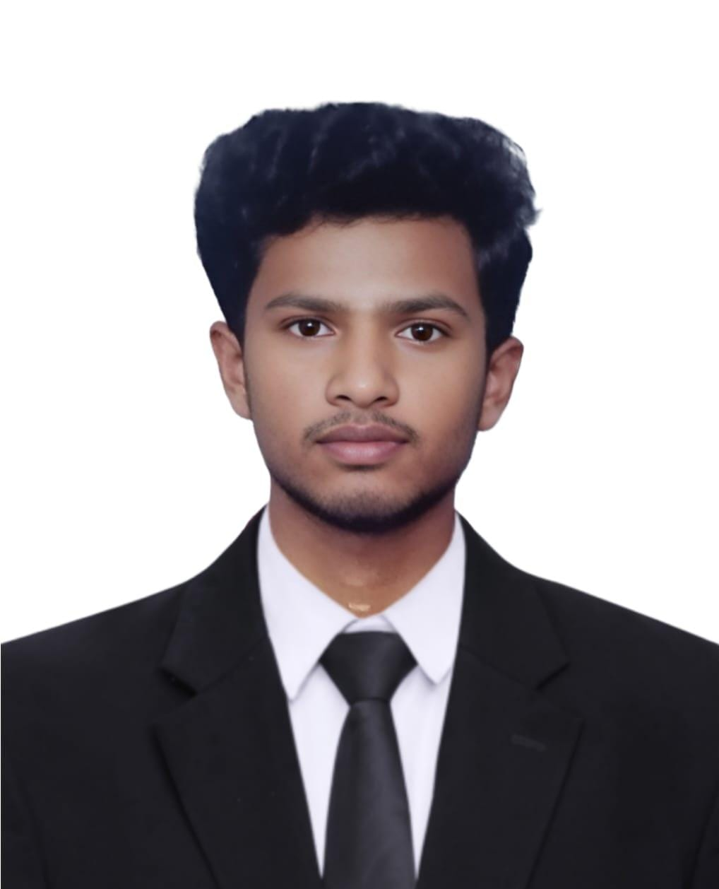

# Ragul S - Personal Portfolio Website

Welcome to the personal portfolio repository of **Ragul S**. This modern, interactive website showcases my skills, projects, and professional background as an Artificial Intelligence & Data Science student and Full Stack Developer.

Built with performance and aesthetics in mind, this project leverages the latest web technologies to provide a smooth, engaging user experience.

 
*(Note: Replace `public/profile.jpg` with an actual screenshot of the landing page if available)*

## 🚀 Tech Stack

This project is built using the following technologies:

- **Framework:** [Next.js 15](https://nextjs.org/) (App Router)
- **Library:** [React 19](https://react.dev/)
- **Styling:** [Tailwind CSS](https://tailwindcss.com/)
- **Animations:** [Framer Motion](https://www.framer.com/motion/)
- **UI Components:** 
  - [Radix UI](https://www.radix-ui.com/) (Primitives)
  - [Lucide React](https://lucide.dev/) (Icons)
  - [React Icons](https://react-icons.github.io/react-icons/)
- **Theme:** [Next-Themes](https://github.com/pacocoursey/next-themes) (Dark/Light mode)
- **Forms:** [Web3Forms](https://web3forms.com/) (Contact form handling)

## ✨ Features

- **Interactive Hero Section:** Engaging introduction with parallax effects and floating 3D-style elements.
- **About Me:** Detailed section with personal info and animated statistics.
- **Skills Showcase:** Visual grid of technical skills with hover effects and proficiency indicators.
- **Projects Gallery:** curated list of projects (AI/ML, Web Dev) with links to code and live demos.
- **Certifications:** Carousel or grid display of professional certifications (optional/expandable).
- **Contact Form:** Fully functional contact form integrated with Web3Forms for direct email delivery.
- **Responsive Design:** Optimized for all devices (Mobile, Tablet, Desktop).
- **Dark/Light Mode:** Seamless theme switching support.

## 🛠️ Getting Started

Follow these steps to set up the project locally.

### Prerequisites

- Node.js (v18 or higher recommended)
- npm or yarn

### Installation

1. **Clone the repository:**
   ```bash
   git clone https://github.com/raguls18/Ragul-S_Portfolio.git
   cd Ragul-S_Portfolio-main
   ```

2. **Install dependencies:**
   ```bash
   npm install
   # or
   yarn install
   ```

3. **Run the development server:**
   ```bash
   npm run dev
   # or
   yarn dev
   ```

4. **Open your browser:**
   Navigate to [http://localhost:3000](http://localhost:3000) to view the application.

## 📂 Project Structure

```bash
.
├── app/                  # Next.js App Router pages and layouts
│   ├── layout.jsx        # Main root layout
│   ├── page.jsx          # Home page (Portfolio landing)
│   └── globals.css       # Global styles
├── components/           # Reusable UI components
│   ├── ui/               # Shadcn/Radix UI primitive components
│   ├── ContactSection.jsx # Contact form section
│   ├── ThemeToggle.jsx   # Dark mode toggle
│   └── ...
├── public/               # Static assets (images, icons)
├── styles/               # Additional stylesheets
├── tailwind.config.ts    # Tailwind CSS configuration
└── package.json          # Project dependencies and scripts
```

## ⚙️ Configuration

The project uses **Web3Forms** for the contact section. 
- The access key is currently configured in `components/ContactSection.jsx`.
- For production, consider moving keys to `.env.local` variables for better security.

## 🤝 Contributing

Contributions, issues, and feature requests are welcome! Feel free to check the [issues page](https://github.com/raguls18/Ragul-S_Portfolio/issues).

## 📄 License

This project is licensed under the [MIT License](LICENSE).

---
**Ragul S** - *Artificial Intelligence and Data Science Student*
[GitHub](https://github.com/raguls18) | [LinkedIn](https://www.linkedin.com/in/ragul-s-37a8b9271/)
